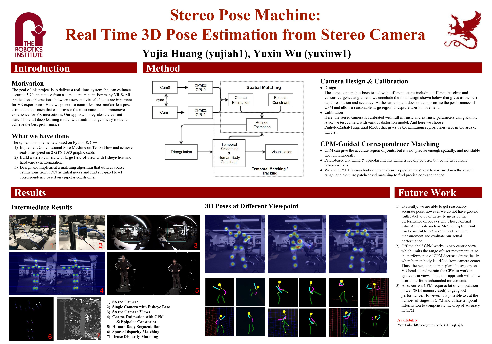

# Stereo Pose Machines



Check out our [Video Demo](https://www.youtube.com/watch?v=-BcL1aqEsjA) !

## Dependencies:
+ A pair of Pylon Cameras
+ Eigen3
+ OpenCV
+ [tensorpack](https://github.com/ppwwyyxx/tensorpack)
+ PyYaml
+ PyOpenGL

## Compile:
```
make -C src/cpp
```

## Test Cameras:
```
cd src/cpp && ./main.bin
```
Two cameras could be detected in any order. To make the order consistent across runs, `src/cpp/pylon_camera.cc`
assumes that the camera whose name contains "711" is the first camera. You'll need to change it
for your case.

## Calibrate Cameras:
Use `main.bin` to take images and use Kalibr to produce a yaml similar to the files in `calibr-1211`.
Change the path in `main.py` to your own calibration results. Also change the undistortion
coefficients in `cpp/camera.hh`.

## Test CPM is working:
Download model to `data/cpm.npy`. See [tensorpack CPM examples](https://github.com/ppwwyyxx/tensorpack/tree/master/examples/ConvolutionalPoseMachines) for instructions.
```
cd src/cpp && python2 main.py -t 'cpm-viewer'
```
It will use 2 GPU to run 2 CPMs in parallel.

## Test 3D Visualization is working:
```
cd visualization && python2 main.py ../data/final-demo.npy
```
Its OpenGL bindings don't work on certain systems (e.g. Ubuntu). Don't know why.

## Run Stereo CPM:
```
cd src/cpp && python2 main.py -t 'cpm3d'
```
This will send 3d point coordinates to `0.0.0.0:8888`. You can use `--host <ip address>` to change the IP.

To start a server (maybe on some other computers) to receive points and visualize:
```
cd visualization && python main-server.py
```
